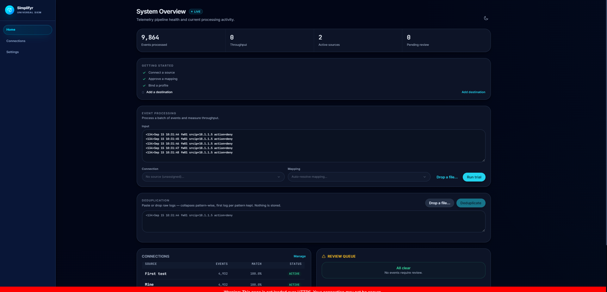
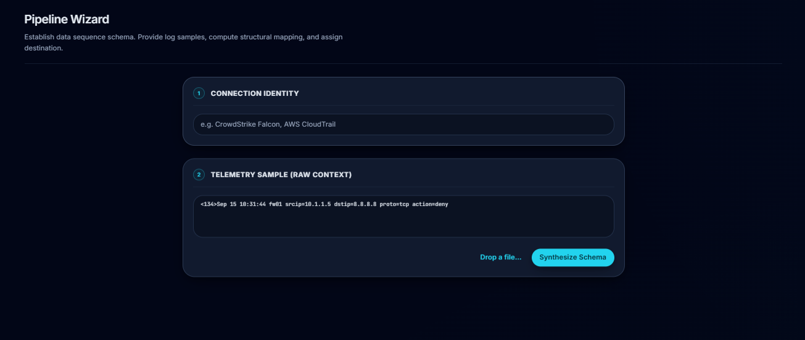
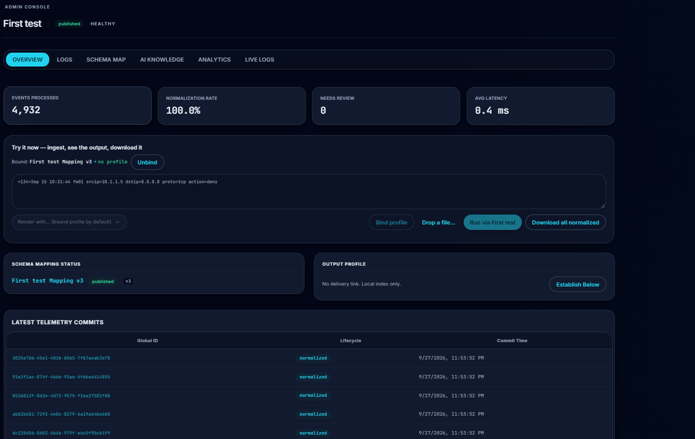
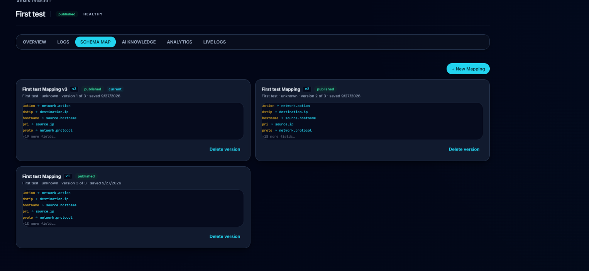
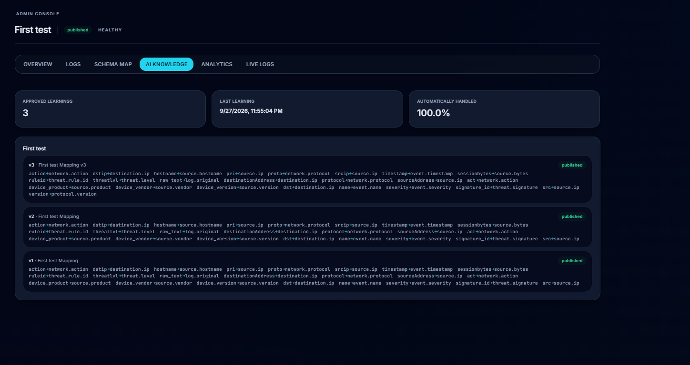
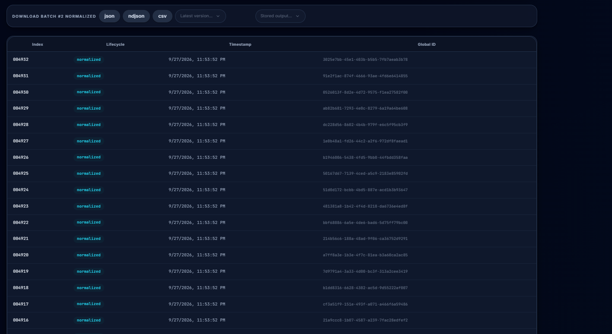
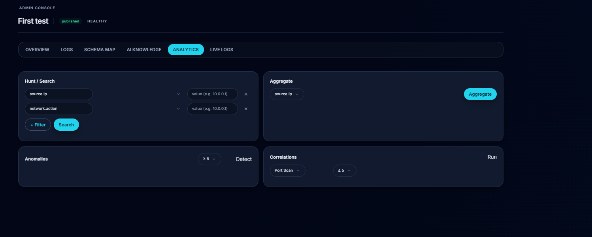

# 🛡️ Simplifyr

**Simplify the signal. Preserve the truth.**


[](https://huggingface.co/Sking0123/Simplifyr1.5b)


**Simplifyr** is a Universal Log Pre-processing Framework (ULPF). It ingests messy,
heterogeneous logs from firewalls, servers and network boxes, figures out what each
field *means*, and emits clean, standardized, user-defined output — **without losing
the original event** and **without you hand-writing parsers**.

> Not a SIEM, firewall, data lake, or chatbot. Simplifyr is the
> **semantic-normalization layer** that sits between your noisy devices and your
> SIEM / analytics / ML downstream.

## ⚙️ How it works

## 🎥 Demo Video

[](https://drive.google.com/file/d/19NJiCJb9eSOgWFk-ofpo5eyFZ0_P1zTD/view?usp=sharing)

```
raw log ──▶ DETECT ──▶ PARSE ──▶ NORMALIZE ──▶ OUTPUT ──▶ your SIEM / lake / webhook
  (syslog,      (format)    (fields)   (semantic      (your
   JSON, CEF,                                  fields)      schema)
   LEEF…)
                    │  unknown shape?       │  structure changed?
                    ▼                       ▼
              🟡 QUARANTINE ──────▶ 🟠 DRIFT QUEUE ──▶ approve ──▶ new mapping version
              (held, never lost)   (one item per field-shape, auto-named)
```

- **Known shape?** Normalizes instantly through the published mapping. Zero clicks.
- **New shape?** Held in quarantine + one drift item per *field-shape* (100 identical
  anomalies = 1 item, not 100). Approve once → mapping versioned, whole pile
  reprocesses itself out of quarantine.
- **Garbage?** Dead-letters separately. Purge-all per type, one confirm.

## ✨ What it does

| Area | Highlights |
|---|---|
| 📥 **Ingest** | Syslog UDP/TCP listeners, HTTP API, file tail, Kafka ingress, batch endpoint (100k lines), Trial Run panel with live throughput |
| 🧩 **Normalize** | Syslog / JSON / XML / CSV / CEF / LEEF parsers → 26-field semantic catalog (`source.ip`, `network.action`, …) + custom-typed fields |
| 🗺️ **Mappings** | Versioned per-source knowledge, one row per lineage, recipe auto-binding, mapping delete with safe unbind |
| 🔍 **Review** | Grouped Telemetry Inspection (approve-all / purge-all per type), drift queue with AI proposals + confidence, human override |
| 📊 **Analytics** | Threat hunting, group-by aggregation, anomaly + correlation rules, pattern-wise **log dedupe** (paste/drop → first log per shape) |
| 📤 **Export** | JSON / NDJSON / CSV, uncapped, counts baked into file + filename — whole system or one trial's exact rows |
| 🤖 **Local AI** | Heuristic baseline built in; fine-tuned **Qwen2.5-1.5B** (`simplifyr:1.5b`) serves suggestions offline via Ollama — no API keys, ever |

## 🖥️ Application

<p align="center">
  
</p>

<p align="center"><em>Dashboard — operational overview of sources, processing and system activity.</em></p>

### Connect and onboard

<p align="center">
  
  
</p>

<p align="center"><em>Source onboarding and detailed connection configuration.</em></p>

### Mappings and adaptive knowledge

<p align="center">
  
  
</p>

<p align="center"><em>Versioned mappings and the knowledge layer used to support adaptive processing.</em></p>

### Inspect and analyze events

<p align="center">
  
  
</p>

<p align="center"><em>Raw event inspection and analytics for processed telemetry.</em></p>

### Configure outputs

<p align="center">
  
</p>

<p align="center"><em>Output profiles for controlling the shape of normalized events delivered downstream.</em></p>

## 🤖 The AI story (all-local, RTX 3050-friendly)

No cloud, no keys. Two providers, one switch (`AI_PROVIDER`):

| Model | Mapping F1 | Drift | Abstain |
|---|---|---|---|
| Heuristic (default, instant) | 0.9333 | 1.0 | 1.0 |
| Generic `qwen2.5:1.5b` | 0.0 | 0.75 | 0.0 |
| 🟢 **`simplifyr:1.5b` v2 (ours)** | **1.0** | **1.0** | **1.0** |

- Trained on 2,406 instruction pairs (human approvals + synthetic bootstrap) with
  QLoRA on a 4 GB RTX 3050; merged + GGUF'd to Ollama (~6 tok/s — plenty for
  short suggestions, heuristic fallback on every call).
- The eval gate (`tests/golden/`, `run_eval()`) fails any provider change that
  scores below baseline. Full runbook: [`training/README.md`](training/README.md).
- Serve it: `AI_PROVIDER=ollama OLLAMA_MODEL=simplifyr:1.5b` (or `backend/.env`),
  or `ollama pull hf.co/Sking0123/Simplifyr1.5b` on any machine.

### 🤗 Fine-tuned model on Hugging Face

[](https://huggingface.co/Sking0123/Simplifyr1.5b)
[](https://huggingface.co/Sking0123/Simplifyr1.5b)
[](https://huggingface.co/Sking0123/Simplifyr1.5b)
[](https://huggingface.co/Sking0123/Simplifyr1.5b)
[](https://huggingface.co/Sking0123/Simplifyr1.5b)

> **Sking0123/Simplifyr1.5b** — our Qwen2.5-1.5B fine-tune for log-field → semantic
> mapping, with GGUF (Ollama) + fp16 safetensors (Transformers), training details,
> eval scores, and one-line pull instructions. Star it if it helps your SOC. ⭐

## 🧰 Tech stack

| Layer | Tech |
|---|---|
| API | **FastAPI** + SQLAlchemy 2 + Alembic migrations (SQLite dev / Postgres prod) |
| Pipeline | Deterministic `ProcessingEngine`, asyncio workers, Kafka-swappable bus |
| AI | PyTorch + transformers + PEFT/QLoRA (train) · **Ollama** (serve) |
| UI | **React 18 + TypeScript + Vite + Tailwind**, WebSocket live views |
| Infra | Docker Compose (Postgres · Redis · MinIO · Kafka · Ollama), Prometheus `/metrics` |
| Quality | **274 pytest tests** (+3 PG-gated), `tsc` + `oxlint` clean per commit |

## 🚀 Quickstart

```powershell
# backend (from backend/ so backend/.env loads)
D:\...\SIMPLIFYR_2\.venv\Scripts\python.exe -m uvicorn app.main:app --reload --port 8000

# frontend (from frontend/)
npm install
npm run dev        # → http://localhost:5173 (proxies /api → :8000)
```

```powershell
# or everything at once
docker compose up -d
docker compose exec ollama ollama pull hf.co/Sking0123/Simplifyr1.5b
```

```powershell
# tests (repo root)
.\.venv\Scripts\python.exe -m pytest tests -q
```

## 🗂️ Repo layout

```
backend/            FastAPI app (engine, APIs, AI layer, migrations)
frontend/           React console (Home, Connections, Analytics, Review Queue, Settings)
parsers/            Format detection + parsers (syslog, JSON, XML, CSV, CEF, LEEF…)
packages/           Shared domain libs (event/semantic/mapping/output-profile models)
training/           Fine-tune pipeline (data, scripts, Modelfile, runbook)
tests/              274 tests incl. golden AI gate + migration-chain pin
scripts/             Dev utilities (firehose log generator…)
sample-data/        Golden fixtures · docs/  design notes
```
